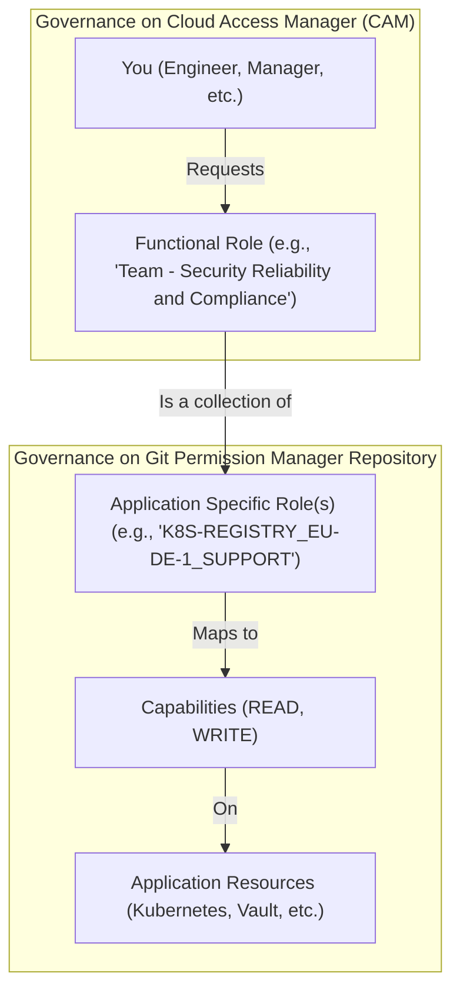

# Overview: SAP Cloud Infrastructure Permission Concept#

This document provides a high-level overview of the permission concept for SAP Cloud Infrastructure (SCI), intended for all engineers, managers, and service owners. 
The primary goal of this concept is to create a mature, clear, scalable, and secure framework for managing authorizations.

## The North Star: Automation and Role-Based Access

The core principle of our permission management is automation. 
Wherever possible, permissions are derived from your organizational role (as defined in HR systems) and automatically provisioned. 
The system is designed to be compliant with industry standards (like ISO 27001, PCI DSS) and enforce the principle of least privilege.

## How It Works: A Layered Approach

**On CAM we govern access requests** to Functional Roles (also known as CAM Profiles).

**On Git we govern the Roles** themselfves, which includes Functional Roles as well as the more granular Application Specific Roles (also known as CAM Access Levels) that define actual permissions.

**On Applications we enforce the permissions** defined in the Application Specific Roles.

Or in other Words:

**You Request a Role:** As an end-user, you will request access to a Functional Role through SAP's Cloud Access Manager (CAM).

**Roles Define Access:** These Functional Roles are collections of more granular permissions called Application Specific Roles.

**Applications Enforce Permissions:** The Application Specific Roles translate to actual capabilities (like READ, WRITE, ADMIN) on specific application resources (like a Kubernetes namespace or a Vault secret engine).

This can be visualized as follows:

