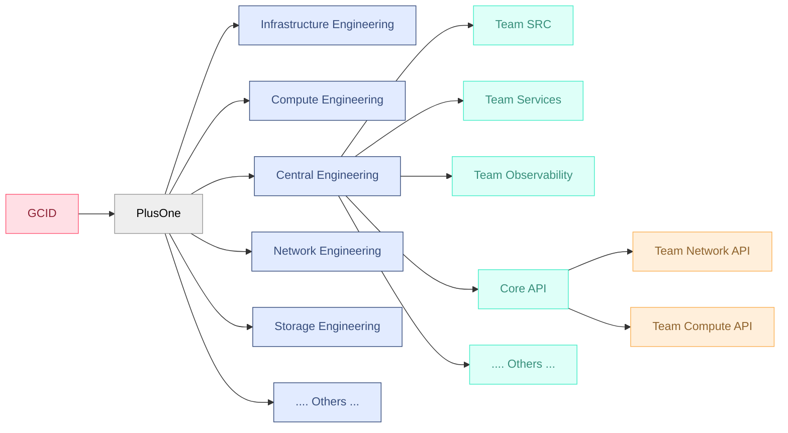
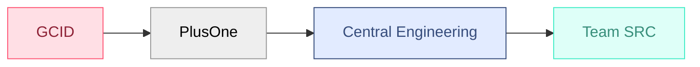
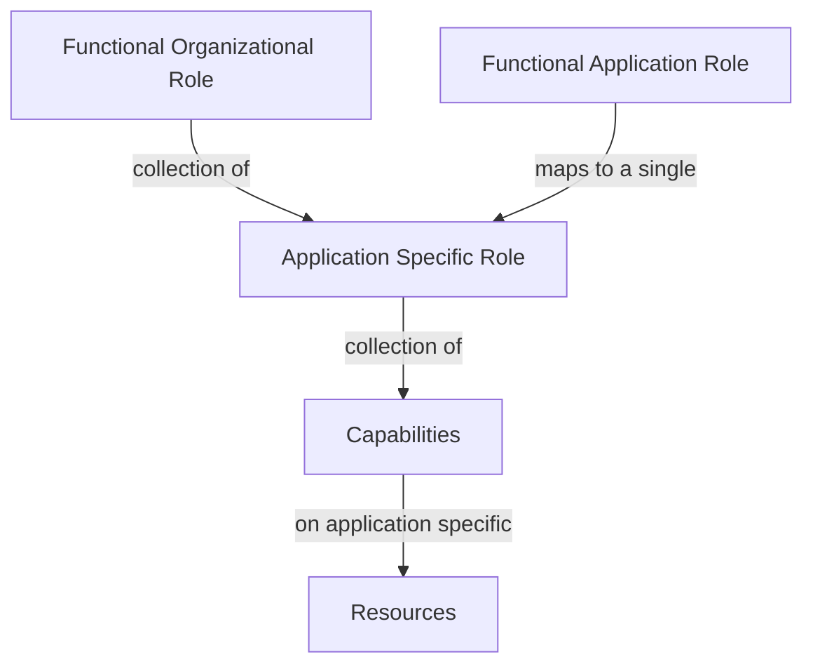
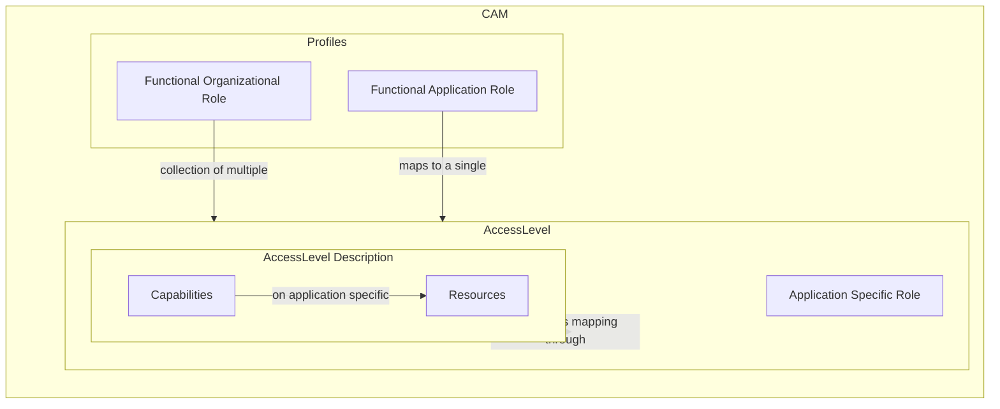
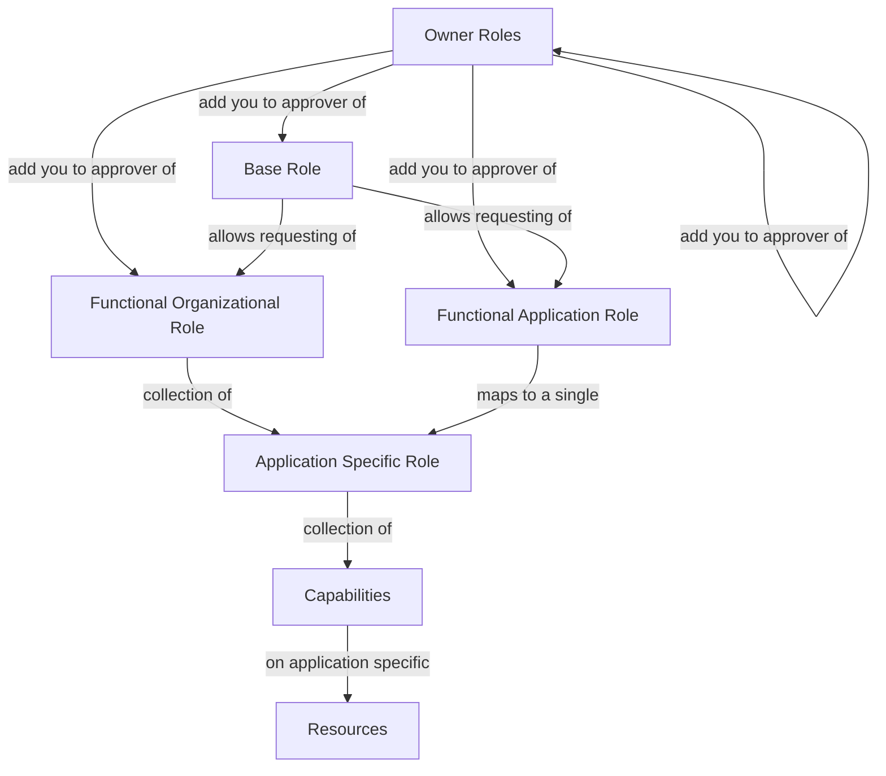
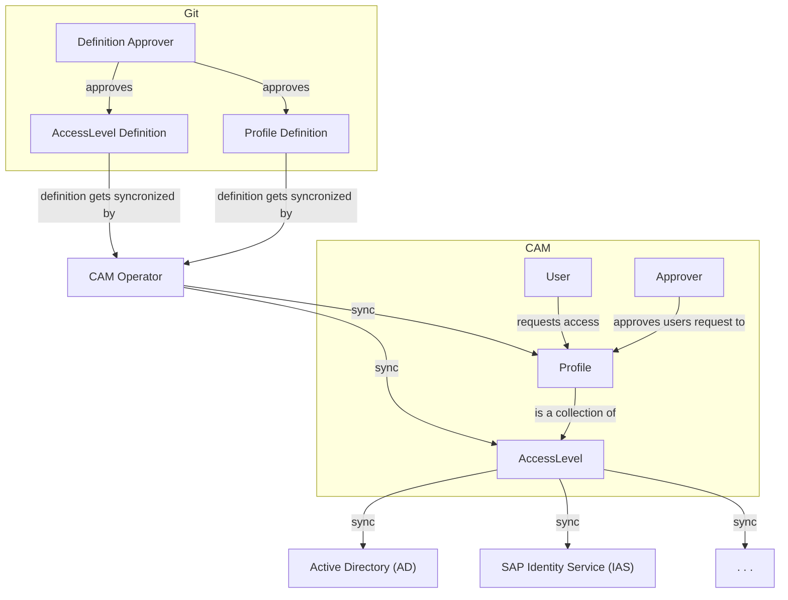
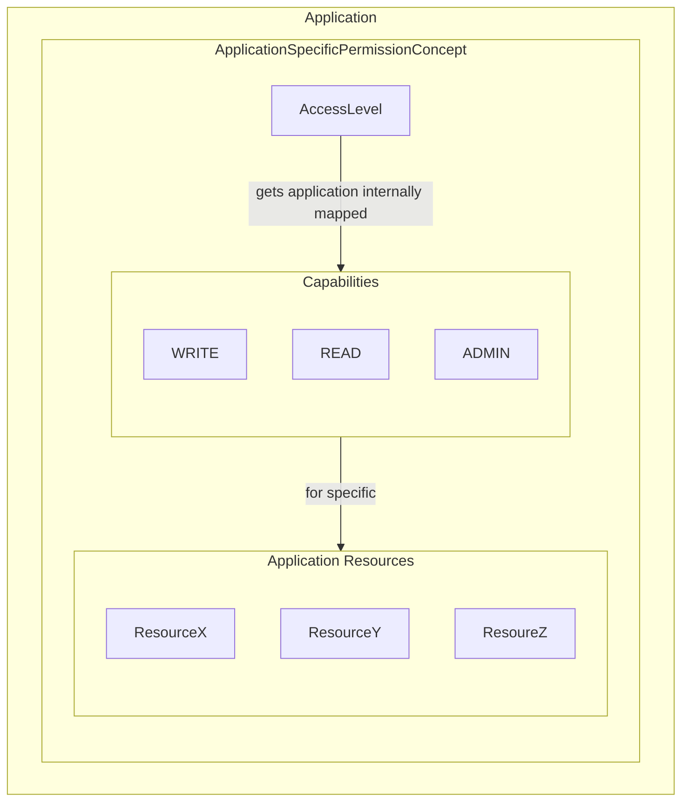

# SAP Cloud Infrastructure -  Permission Concept 2.0

SAP Cloud Infrastructure reached a state where we need to refactor the permission concept to archive a more mature, clear and scalable concept for managing authorizations for the operation and development of SCI.

## Process Owners

- David Rochow
- Alessandro Avagliano

# Permission Management Design Targets

This Document explains the general permission management strategy of SAP Cloud Infrastructure, the Governance, Concepts, Processes and implementation details behind.

All this has a set of major boundaries

### System Integration & Compatibility
- **Support all used systems** - Must integrate with LDAP, OIDC, SAML, Keystone, TACACS, CAM, and SAP IAS
- **Respect protocol limitations** - Work within group limits of OIDC (~100-200 groups) and SAML (~100-150 groups) per session
- **Optimize group usage** - Encourage minimal Access Levels/Groups to stay within system constraints

### Approval & Provisioning Efficiency
- **Distribute approval workload** - No individual should approve hundreds of permission requests weekly; approvals should be distributed across many individuals
- **Minimize time-to-permission** - Reduce the duration from permission request to approval and effective availability
- **Enable self-service capabilities** - Users can request and manage their own permissions within defined guardrails
- **Automate lifecycle provisioning** - Permissions automatically adjust based on HR events (joins, transfers, terminations)
- **Derive baseline permissions** - Use HR data to establish sensible default permissions for roles

### Administrative Access Control
- **Minimize permanent admin permissions** - Reduce standing administrative privileges across systems
- **Implement Just-In-Time (JIT) access** - Provide temporary privilege elevation with automatic expiration
- **Establish break-glass procedures** - Enable audited emergency access paths without blocking critical operations

### Permission Granularity & Discovery
- **Increase permission granularity** - Enable fine-grained access control where required
- **Enable regional segregation** - Support privilege separation by geographical region
- **Support resource hierarchies** - Allow segregation of sub-resources (e.g., Namespaces)
- **Enhance permission discovery** - Users can easily find available permissions and understand their purpose
- **Capture request context** - Collect and maintain rationale for permission requests to inform approval decisions

### Governance & Compliance
- **Define clear ownership** - Establish unambiguous ownership for all permissions and resources
- **Implement governance rules** - Create and enforce consistent governance concepts across the system
- **Ensure audit trail completeness** - Log every permission grant, modification, and usage with full context
- **Detect access anomalies** - Identify unusual permission usage patterns or access requests
- **Compliance with industry standards** - All parts of the concept need to be compliant with  industry standardts such as:
    - IT Grundschutz
    - PCI DSS
    - ISO 27001
    - NIST
    - and others
- **Compliance with SAP standards** - All parts of the concept need to be compliant with  SAP internal standardts for permission management, such as:
    - TODO: Add Product standard links

### Infrastructure & Operations
- **Implement permissions as code** - Make permission schemes versionable, testable, and deployable through CI/CD pipelines


# The Abstract

## The Permission Management Northstar

Automation is embedded SAP Cloud Infrastructure DNA, and thus it should be enabled in SAP Cloud Infrastructures Permission Management.

Wherever possible permissions should be derivied from organizational membership and automatically requested/provisioned and maintained. It should be as easy as possible for users to perfom tasks that they are expected to perform as part of their Role.

In an ideal world we would assume we have a Team X, and for each and every team member in Team X there is the same set of permissions required to perform their Job. In reality though, we have a way more complicated situation. We have cross functional collaboration groups, defacto sub-teams within the teams and more over arching cross functional "units".

At the same time we have to comply with security & compliance standards and fullfill a least-priveldge permission assignment.

How does this fit together?

We Map our organizational hirarchy and our virtual cross collaboration groups. Assignment and Access to those should be as easy as possible from the perspective of the indiviudal contributor. Furhtermore we allow sub-categorization of those organizational roles to respect establishment of sub-teams and sub-workgroups within a team/workgroup structure.

But what does this mean?

The minimal set of Functional Role representation is the actual HR Tree, e.g.:



So that means going with a concrete example from the representation above:



If a Employee is Working in <span style="padding: 5px;font-size: 0.8em; font-weight: bold;border: solid; border-color:#46EDC8;background-color:#DEFFF8; color:#378E7A;">Team SRC</span> he should ideally automatically get multiple roles assigned. In this concrete example that means we can:

- Assign <span style="padding: 5px;font-weight: bold;border: solid;font-size: 0.8em; border-color:#FF5978;background-color:#FFDFE5; color:#8E2236;">SCI - OU - GCID</span>
    - Automatic Request based on People Data
    - via **Auto-Approve** based on the Cost Center Name Pattern: ```GCID*```

- Assign <span style="padding: 5px;font-weight: bold;border: solid;font-size: 0.8em; border-color:#999999;background-color:#EEEEEE; color:#000000;">SCI - OU - PlusOne</span>
    - Automatic Request based on People Data
    - via **Auto-Approve** based on the Cost Center Name Pattern: ```GCID PlusOne*```

- Assign <span style="padding: 5px;font-weight: bold;border: solid;font-size: 0.8em; border-color:#374D7C;background-color:#E2EBFF; color:#374D7C;">SCI - OU - Central Engineering</span>
    - Automatic Request based on People Data
    - via **Manual Approve** by organizational unit "Owner" or it's Delegate(s)

- Assign <span style="padding: 5px;font-weight: bold;font-size: 0.8em; border: solid; border-color:#46EDC8;background-color:#DEFFF8; color:#378E7A;">SCI - Team - Central Engineering SRC</span>
    - Automatic Request based on People Data
    - via **Manual Approve** by organizational unit "Owner" or it's Delegate(s)


## Concept Details

SAP Cloud Infrastructure uses Role Based Access Control to manage permissions to Resources. There are two general kinds of Roles that users can requested:

**Functional Organization Roles** - which are Roles that map to organizational structures within SAP Cloud Infrastructure such as Teams, Support Groups or other units of organizational structure for Human Resources

**Functional Application Roles** - which are specific Roles that give access to Resources of a specific Application/Service/Process

**Organizational Roles** -- which are a collection of **Application Specific Roles**(NOT to be confused with *Functional Application Roles*) while a **Functional Application Role** just always map to a single **Application Specific Role**.

**Application Specific Roles** --which are actual Roles on the individual Application/Service/Process that represent a collection of **Capabilities** on the **Resources** of an Application/Service/Process




Access to **Functional Organizational Roles** and **Functional Application Roles** can be requested through the **CAM**, which is SAP's Access Management solution.

On **CAM**(*Cloud Access Manager*) the **Organizational Roles** and **Functional Application Specific Roles** are called **Profiles**. The **Application Specific Roles** are called **Access Levels**

While the actualy effective mapping of **Capabilities** and **Resources** to the respective **Access Level** is happening on the individual Application level through their **Application Specific Permission Concept**, the **Access Levels** must document those mappings within their description. The concrete format and requirements of that are described in detail at [Access Level Definition](#TODO)



In addition to the two Functional Roles that are always mapped to at least one **Application Specific Role** and therefore effective functional permissions on respective Applications, there is an additional category of Roles called **Base Roles**. As the **Functional Roles**, **Base Roles** are **Profiles** on **CAM** but they do not directly provide any direct permissions on any application but allow People to request certain **Functional Roles (Profiles)** on CAM.




## Management

The Management of Roles and the Management of Assignments to those Roles are strictly separated. This means that **Functional Roles**(Profiles) and **Application Specific Roles**(Access Levels) are defined in an dedicated Git Repository and synchronized to **CAM** via an automation service called **CAM Operator**.

The [CAM Operator](#cam-operator) uses Kubernetes Custom Resource Definitions pulled from the **IAM Git Repository** to synchronize definitions to **CAM**.

CAM does take care of the synchronization of **Application Specific Roles**(Access Levels) to the individual use-cases  for the Application such as **IAS** or **Active Directory**



### Role Management

The definition of **Tools**, **Functional Roles**(Profiles) and **Application Specific Roles**(Access Levels) is done as Configuration as Code on Git. Roles that provide active access to any SAP Cloud Infrastructure **MUST NOT** be defined manually on CAM.

The Definition of Roles on Git **MUST** include the following:
- Name of the Profile/Access Level
- Approvers (as Owner Roles)
    - 1st Level
    - 2nd Level
- Role assignment expiry date
- Description

Furthermore requirements defined in [Functional Roles (Profiles)](#Functional-Roles-Profiles) and [Application Specific Roles (Access Levels)](#Application-Specific-Roles-Access-Levels) **MUST** be verified before merged into the main branch by at least 2 Reviewers. One of the reviewers **SHOULD** be an automated process that verifies the requirements programatically as defined in [Role Definition Verification](#)

#### Configuration as Code Details

Configuration as Code will be using Custom Resource Definitions as defined in  [CAM Operator Types](https://github.tools.sap/cloud-orchestration/cam-operator/tree/main/api/v1alpha1) and will be managed in the central [IAM Repository](#) //@TODO ADD IAM REPO

##### Examples

**//@TODO ADD CRD EXAMPLES**


### Assignment Management

Access to **Functional Roles**(Profile) and the  **Application Specific Roles**(Access Levels) included within them MUST be granted on **CAM** following a 2 step approval process by the approvers defined in the **Functional Role Definition**. Access automatically gets revoked after expiry of the role assginment as per definition.


## Special Regions Rules

### VSNFD Compliant Regions

Additional rules apply for Regions beeing VSNFD compliant, which are:

- eu-de-1


### Role Management

Any **Application Specific Roles**(Access Levels)


## Functional Roles (Profiles)

### Functional Organization Role

#### Naming

The Naming Pattern for **Functional Organizational Role** is:

```
${TYPE} - ${DESCRIPTOR} 
```

**Functional Organizational Roles** represent an organizational unit and are of one of the following ```${TYPE}```:

- Team *(an HR Unit)*
- OU *(any HR Unit above individual Teams)*
- SupportGroup *(non HR Unit)*
- OnCall *(OnCall Role for for a SupportGroup)*

Additonally the following *MUST* be ensured for the ${Descriptor}:
- Descriptor MUST be an self-explanatory descriptor of the organizational unit.
- For SupportGroup the Descriptor matches a official Support Group
- For OnCall the Descriptor matches a official Support Group

##### Examples

```
Team - Security Reliability and Compliance     # Organizational Role for members of the Team SRC
OU - Central Engineering               # Organizational Role for members of the Department OU - Central Engineering
OU - Plus One                          # Organizational Role for members of the Department Plus One
SupportGroup - Containers                      # Organizational Role for members of the Support Group Containers
OnCall - Observability                         # This is the OnCall Role for Support Group Observability
```

#### Ownership

- Every **Functional Organization Role** MUST be owned by a dedicated Manager that has the responsibility for the respective Department, Team or Support Group.
- Ownership MAY be delegated to other Persons

### Functional Application Role

#### Naming

These Roles are used to directly assign Application Specific Roles to Users. Therefore only 1 **Application Specific Role** is mapped to them and the naming pattern is as follows:

```
${APP} - $(REGION) - $(APP_SUB_CLASSIFY) - ${PERMISSION_LEVEL}
```

For details about the individual components use the reference on [Application Specific Role Components](#Components)

Exceptions for which more than 1 **Application Specific Role** can be granted to a **Functional Application Role**:

- When access is separated by Region but there is legitimate use case for a Multi Region Access on **Functional Application Role** Level
- Profile Identifying Access Levels

#### Examples

```
KEPPEL - EU-DE-1 - ADMIN
VAULT - EU-DE-1 - Team SRC KV - ADMIN
NETBOX - WORLD_WIDE - SUPPORT
```

## Base Roles

Base Roles are not giving any permission directly but allow users to request other Roles.

There the naming pattern is:

```
PERMIT ${Descriptor}
```

While majority of ```${Descriptor}``` Tags are the exact Role Name they permit to request there are use-cases where the Descriptor might differ because those allow access to a whole range of Groups. Examples of that are On-Call or regional restrictions.

## Owner Roles

Owner Roles do not provide any access directly but act as the group of Approvers for other Roles.

```
OWN ${Descriptor}
```
While majority of ```${Descriptor}``` "Tags" are the exact Role Name they add  to request there are use-cases where the Descriptor might differ because those allow access to a whole range of Groups. Examples of that are On-Call or regional restrictions.


## Application Specific Roles (Access Levels)

### Naming

The **Application Specific Roles**(Access Level) naming follows this convention:
```
${APP}_${REGION}_$(APP_SUB_CLASSIFY)_${PERMISSION_LEVEL}
```

#### Components

|  | APP |
|-----------|----------|
|**Required**| yes |
|**Description**| Unique identifier for the application/service/tool |
|**Example Values**| VAULT, KEPPEL, K8SREG, PROMETHEUS, NETBOX |

|  | REGION |
|-----------|----------|
|**Required**| no |
|**Description**| Identifies the geographical region and datacenter, <br /> location unrelated acess levels may use "WORLD-WIDE". Access Levels to systems/resources that are independend from access levels may omit the Region |
|**Example Values**| EU-DE-1, NA-US-1, AP-JP-1, ...., WORLD-WIDE |
|**Notes** | - Represents specific datacenter locations<br>- Must match official region codes<br>|

|  | PERMISSION_LEVEL |
|-----------|----------|
|**Required**| yes |
|**Description**| Defines the scope of permissions |

|  | APP_SUB_CLASSIFY |
|-----------|----------|
|**Required**| no |
|**Description**| Additional classification within a tool, when necessary|
|**Example Values**| For k8s: namespace names<br>For Vault: KV engines |
|**Notes** | Used when more fine grained roles are required |


| PERMISSION LEVEL | Description | Recommended | Criticality |
| -------- | -------- | -------- | -------- |
| AUDIT | Typically provides read only access to non-critical configurations and resources within the Application resources | Always | Low |
| SUPPORT | Typically provides read & write access to non-critical configurations and resources within the Application | Always | Medium |
| EXTENDED | Used in cases where access to a subset of critical functionality is granted in addition to read & write access or if for certain sub-resources an additional segregation is required | Only in Edge Cases | High |
| ADMIN | Typically provides full access to all resources within the application | Always | Critical |
| SUPER | *ONLY USED IF ABSOLUTELY NECESARRY* Used in cases where an additional "Super Admin" Role is required for further segregation of cirtical operations | Only in Edge Cases | Critical |


This means the above Permission Levels have the following hierarchy:

```
SUPER > ADMIN > EXTENDED > SUPPORT > AUDIT
```


#### Why the naming convention follows this order

The order of components of this definition is following logical usability and importance purposes:

- We want to have permissions for a single tool/service grouped
- We want on the next level the actual permission levels for an application grouped together
- Finally we want an consistent ordering and therefore put the "optional" part to the end

#### Examples

```
K8S-REGISTRY_ADMIN_NA-US-1_MONITORING-NS     # k8s ADMIN in NA-US-1 in Namespace Monitoring
K8S-REGISTRY_ADMIN_NA-US-1_HEUREKA-NS        # k8s ADMIN in NA-US-1 in Namesapce Heureka
K8S-REGISTRY_SUPPORT_EU-DE-1                 # k8s SUPPORT in EU-DE-1
K8S-REGISTRY_SUPPORT_NA-US-1                 # k8s SUPPORT in NA-US-1
K8S-REGISTRY_SUPPORT_NA-US-2_VAULT-NS        # k8s SUPPORT in NA-US-1 in Namespace Vault
VAULT_ADMIN_QA-DE-1                          # vault ADMIN in QA-DE-1 
VAULT_SUPPORT_GLOBAL_TEAM-SRC-KV             # vault SUPPORT in Global in KeyValueStore team-src
VAULT_SUPPORT_GLOBAL                         # vault SUPPORT in Global
```

#### Application Specific Permission Concept



**Application Specific Roles**(Access Level) have an associated **Application Specific Permission Concept** which **MUST** be documented as follows:

- The first line of the description/mapping is specifying the used spec
- Only one spec can be used within one Application Specific Roles
- Documented wihin the description of an **Application Specific Role**
- Description uses the following pattern ```${CCRN} ${CAPABILITY}```
- ${CCRN} is a valid [Common Cloud Resource Name](https://github.wdf.sap.corp/PlusOne/resource-name) following the specified spec
- ${CAPABILITY} uses the common [taxonomy for capabilities](#Capability-Taxonomy)

##### Example

Application Specific Roles (Access Level) Name:
```
K8S-REGISTRY_ADMIN_NA-US-1_KEPPEL-NS
```

Application Specific Roles (Access Level) Description:
```
ccrn: apiVersion=k8s_registry.ccrn.sap.cloud/v1
ccrn: apiVersion=k8s_registry.ccrn.sap.cloud/v1, kind=*, cluster=*, namespace=keppel READ
ccrn: apiVersion=k8s_registry.ccrn.sap.cloud/v1, kind=*, cluster=*, namespace=keppel WRITE
ccrn: apiVersion=k8s_registry.ccrn.sap.cloud/v1, kind=*, cluster=*, namespace=keppel DELETE
```

## Approvals

### Approval of Access Requests

#### Functional Organizational Roles
Access Requests to **Functional Organizational Roles** MUST be approved by 2 seperate Managers within GCID PlusOne.
The responibility for an timely review lies with the Manager that owns the respective Role and
the current escalation Manager On Call but also every other Manager is allowed to perform the review if necesarry.


#### Functional Application Roles

Access Requests to  **Functional Application Roles** MUST be approved by 2 seperate People of the following groups:

- Managers within GCID PlusOne
- Owners of the Functional Application Role

The respoinsibility for a timely review lies with the Owners of the Functional Application Role and the current escalation Manager On Call.

### Approval of Role Definitions

Role Definitions on Git MUST be approved by

- **(default case)** at least one of the Owners of the Identity & Access Management Process of SAP Cloud Infrastructure, and ALL affected Stakeholders

**OR**

- **(urgent cases)** 2 Managers

##### Affected Stakeholder

An affected Stakeholder is every Person who is Owner of the Profile or any Access Level that got changed.

## Access Expiry

- All Access to Roles expire after at most 6 Months
- Access to **OnCall** Roles expire after at most 7 Days

# Appendix

## Used Terms

### Access Level

Access Level is a Term from CAM. Within our conecept it maps to an **Application Specific Role** and it represents an actual access to some application.

### Profile

Profile is a Term from CAM. Profiles can be requested by humans and are the defacto Roles humans can assume.

### CAM

SAP Cloud Infrastructures internal Identity Access Management s

### IAS

IAS is the by SCI used SAP Identity tenant

### AD

AD stands for Active Directory

### Tool

The term Tool is used in this Document in context of the CAM "resource" called Tool

### Application

The term application is used as a broad term to describe any kind of Service, Application, System, Tool or Process that might needs Access Control

### Access Request

Describes the requests to get a Profile assigned on CAM

## Capability Taxonomy

### Grouped Capabilities

| Capability Group | Description | Example included operations | Example Actions |
|-----------------|-------------|---------------------|-----------------|
| READ | Read-only access to view resources and their status | e.g.: LIST, GET| View configurations, list resources, search entries |
| WRITE | Modify existing resources | e.g.: UPDATE, RENAME ... | Modify configurations, update resource settings |
| OPERATE | Execute operational tasks | e.g.: START, STOP, EXEC ... | Control resource state, manage operations |
| MANAGE | Full administrative control | ALL_OPERATIONS | Complete resource control |
| SECURE | Security-related operations | e.g.: ENCRYPT, SIGN, ...  | Cryptographic operations |

### Individual Capabilities

#### READ Capabilities
| Capability | Description | Common Use Cases |
|------------|-------------|------------------|
| LIST | Retrieve collections of resources | List available resources, browse catalogs |
| GET | Retrieve specific resource details | View detailed configuration, fetch status |
| WATCH | Monitor resource changes | Monitor status changes, observe logs |
| SEARCH | Advanced resource querying | Complex queries, filtered searches |
| LOGS | Access resource logs | Access audit logs, operation logs |
| DESCRIBE | Get detailed resource information | View complete resource specifications |
| COMPARE | Compare operation | Compare attribute values |

#### WRITE Capabilities
| Capability | Description | Common Use Cases |
|------------|-------------|------------------|
| CREATE | Create new resources | Deploy new instances, create configurations |
| UPDATE | Modify existing resources | Change configurations, update settings |
| PATCH | Partial resource modification | Minor configuration adjustments |
| DELETE | Remove resources | Remove instances, delete configurations |
| LINK | Create resource associations | Connect resources, attach components |
| UNLINK | Remove resource associations | Disconnect resources, detach components |
| RENAME | Move or rename resources | Change resource identifiers |

#### OPERATE Capabilities
| Capability | Description | Common Use Cases |
|------------|-------------|------------------|
| EXEC | Execute commands on resources | Run commands, execute scripts |
| START | Initialize or start resources | Start services, initialize components |
| STOP | Halt resource operation | Stop services, halt components |
| RESTART | Reinitialize resources | Restart services, reboot components |
| SCALE | Modify resource capacity | Adjust resource limits, modify quotas |
| PROXY | Proxy operations | Service proxying |
| ATTACH | Resource attachment | Attach to running resources |
| PORT_FORWARD | Port forwarding | Forward local ports to services |

#### MANAGE Capabilities
| Capability | Description | Common Use Cases |
|------------|-------------|------------------|
| GRANT | Assign resource permissions | Grant access rights, authorize usage |
| REVOKE | Remove resource permissions | Remove access rights, withdraw authorization |
| APPROVE | Authorize operations | Approve changes, validate operations |
| REJECT | Deny operations | Reject changes, invalidate operations |
| DELEGATE | Transfer control | Assign ownership, transfer responsibility |

#### SECURE Capabilities
| Capability | Description | Common Use Cases |
|------------|-------------|------------------|
| ENCRYPT | Encrypt data | Use encryption engines, encrypt secrets |
| DECRYPT | Decrypt data | Use decryption engines, decrypt secrets |
| ROTATE | Rotate secrets/keys | Key rotation, secret rotation |
| SIGN | Create signatures | Sign data with keys |
| VERIFY | Verify signatures | Verify signed data |
| AUTHENTICATE | Authentication operations | Authentication, login, binding operations |
| IMPERSONATE | User impersonation | Act as different user | 
